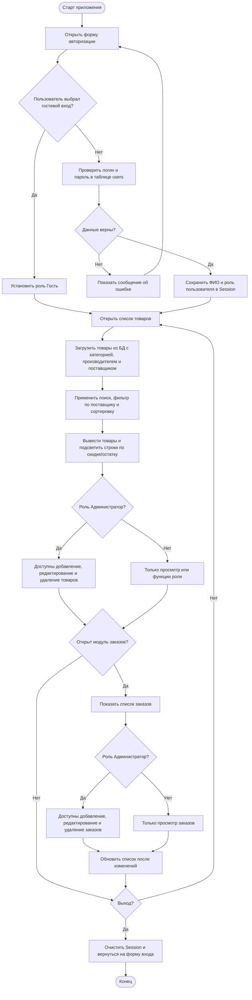

# Алгоритм разработки приложения (модуль №2)

> Исходник алгоритма хранится в текстовом формате, потому что бинарные файлы в репозитории не поддерживаются. При необходимости этот файл можно экспортировать в PDF средствами редактора Markdown.

